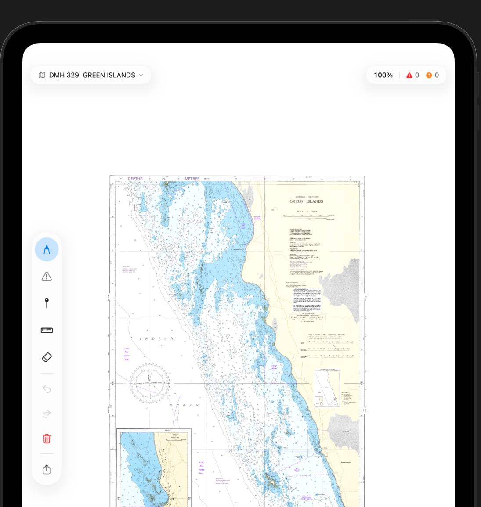

# Samudra

iPad app for marking up nautical charts with the Apple Pencil.



Draw routes, drop hazard rings and notes, measure distance and bearing
between two points. Annotations carry real WGS84 coordinates because the
bundled charts are georeferenced. Export to PNG, PDF briefing, or JSON.

54 charts ship in the app — the full [WA Department of Transport
nautical chart catalogue](https://www.transport.wa.gov.au/marine/charts-warnings-current-conditions/coastal-data-charts/nautical-charts),
Lake Argyle to Esperance.


## To Add
- [ ] Fix Notice to Mariners (NTM)) -> Typing on a keyboard is quite cumbersome (potentially a canvas with text extracted transcripts?)
- [ ] tap on NTM -> popover view; long press on NTM -> editable. 
- [ ] Scribble to delete with pencil?
- [ ] Plans/Drafts Browser -> Some kind of browsing menu for all the maps and stuff.
- [ ] Bottom menu view -> main map/plans(drafting)/settings -> open for brainstorming
 
## Build

Xcode 16, iPadOS 26, iPad Pro.

```
open Samudra.xcodeproj
```

Or:

```
xcodebuild test -scheme Samudra \
    -destination 'platform=iOS Simulator,name=iPad Pro 13-inch (M5)'
```

## Regenerating the chart catalogue

`scripts/fetch_charts.py` queries the WA Transport ArcGIS feature
service and rewrites every sidecar JSON. `--download` also pulls each
PDF into `Samudra/Charts/`.

```
python3 scripts/fetch_charts.py --download
```

Stdlib only, Python 3.11+.

## Not for navigation

Demo. Not SOLAS-compliant. The bundled charts are advisory recreational
charts. Certified marine charts come from the [Australian Hydrographic
Office](https://www.hydro.gov.au/).


## License

Proprietary. See `LICENSE`.
